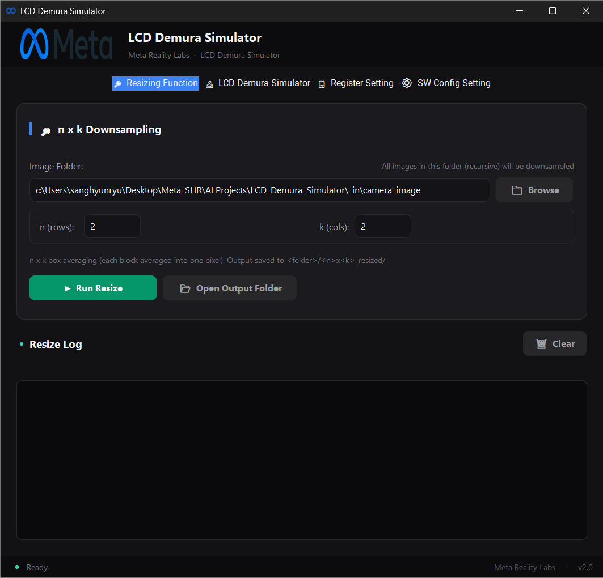
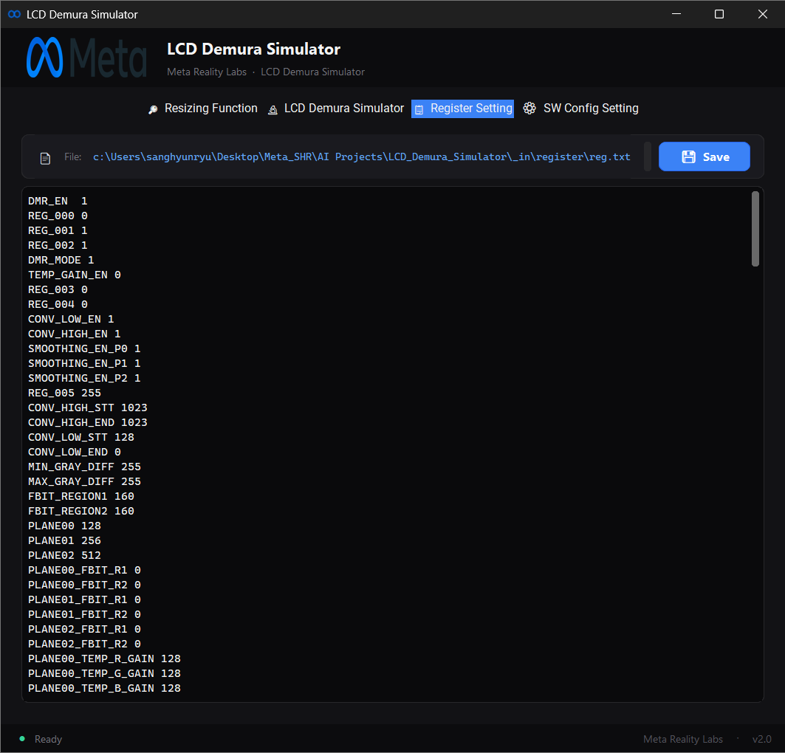
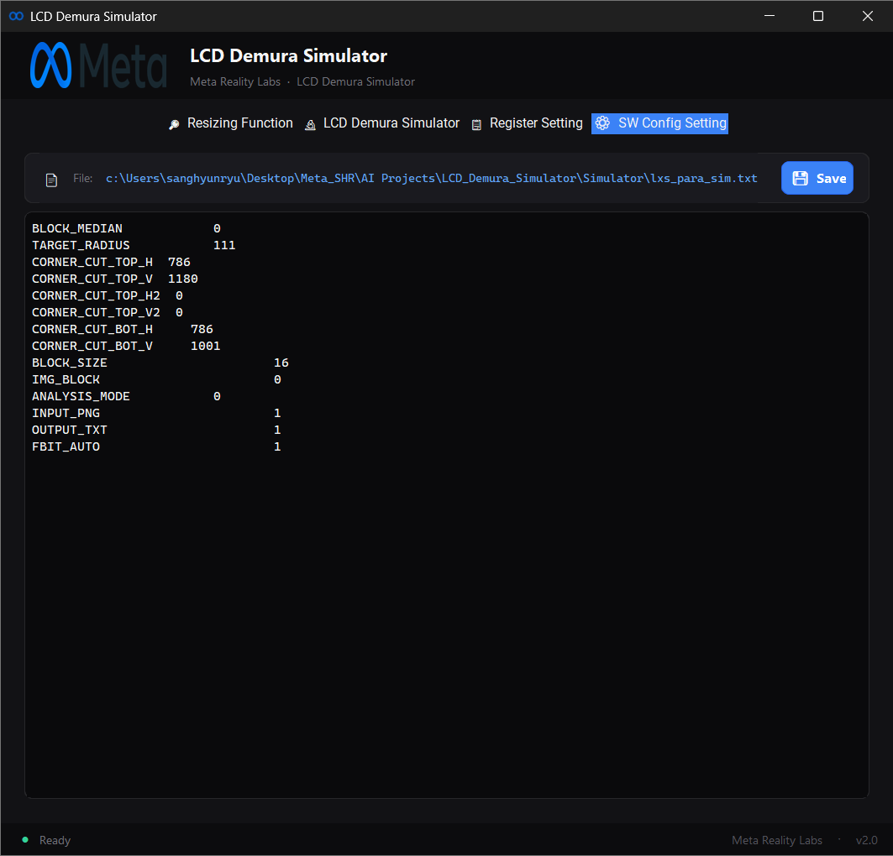

# LCD Demura Simulator

**Meta Reality Labs · LCD Mura Compensation Simulator v2.0**

A desktop GUI application for LCD demura (mura compensation) simulation. It provides an end-to-end workflow for encoding and decoding demura compensation data, editing register/config files, and batch-resizing camera images — all within a modern dark-themed interface built with [CustomTkinter](https://github.com/TomSchimansky/CustomTkinter).

---

## Screenshots

### LCD Demura Simulator Tab
Configure panel parameters, register settings, simulator options, and decoder mode. Run the encoder, decoder, or both sequentially with real-time console output.


### Resizing Function Tab
Batch downsample images using n×k box averaging. All images in a folder are recursively processed and saved to a dedicated output directory.



### Register Setting Tab
View and edit the hardware register configuration file (`reg.txt`) directly within the application. Supports save and reload operations.



### SW Config Setting Tab
View and edit the simulator software configuration file (`lxs_para_sim.txt`) for parameters like block size, target radius, output format, and FBIT mode.



---

## Features

- **Encoder / Decoder Simulation** — Run the LX89507 demura encoder and decoder executables with configurable parameters (panel, register, gray levels, decoder mode)
- **Register & Config Editing** — Built-in text editors for `reg.txt` and `lxs_para_sim.txt` with save/reload functionality
- **Image Resizing** — n×k box-averaging downsampler for batch processing camera images (supports PNG, BMP, TIFF, JPEG)
- **Input Validation** — Automatic camera image naming validation, resolution checks against `H_RES`/`V_RES` in register file, and auto-rename proposals for misnamed files
- **Config Sync** — GUI parameters (DMR_MODE, PLANE values, OUTPUT_TXT, FBIT_AUTO) are automatically synced to config files before each run
- **Modern Dark UI** — Neo-Dark themed interface with Meta branding, DPI-aware sizing, and draggable split panes

---

## Project Structure

```
LCD_Demura_Simulator/
├── main.py                  # Application entry point
├── app/
│   ├── __init__.py           # Package exports
│   ├── gui.py                # Main window (DemuraGUI) — tab layout, header, status bar
│   ├── config.py             # Path constants and default parameter values
│   ├── simulator.py          # Simulator class — runs encoder/decoder executables
│   ├── file_utils.py         # Read/write tab-separated config files (reg.txt, lxs_para_sim)
│   ├── resize_nxk.py         # n×k box-averaging image downsampler
│   ├── theme.py              # Color palette, fonts, spacing (Neo-Dark Theme v3)
│   ├── widgets.py            # Reusable styled widgets (SectionCard, AccentButton, StatusBar, etc.)
│   ├── assets/               # Meta logo and icon files
│   └── tabs/
│       ├── run_tab.py        # LCD Demura Simulator tab — parameters, config, decoder mode, run actions
│       ├── editor_tab.py     # Register / SW Config editor tab — load, edit, save config files
│       └── resize_tab.py     # Resizing Function tab — folder selection, n×k inputs, batch resize
├── Simulator/                # Encoder/decoder executables and parameter files
│   ├── LX89507_Demura_MDC_enc.exe
│   ├── LX89507_Demura_MDC_dec.exe
│   └── lxs_para_sim.txt
├── _in/                      # Input files
│   ├── camera_image/         # Camera-captured images organized by panel (J1, capri1, etc.)
│   ├── display_image/        # Display test images (BMP)
│   └── register/             # Register configuration files (reg.txt)
├── _out/                     # Output directory for simulation results
└── docs/
    └── images/               # GUI screenshots for documentation
```

---

## Requirements

- **Python** 3.10+
- **Dependencies:**
  - [customtkinter](https://github.com/TomSchimansky/CustomTkinter) — Modern dark-themed GUI framework
  - [Pillow](https://python-pillow.org/) — Image loading and processing
  - [NumPy](https://numpy.org/) — Array operations for image downsampling

Install dependencies:

```bash
pip install customtkinter pillow numpy
```

---

## Usage

### Run the Application

```bash
python main.py
```

### Workflow

1. **Set Parameters** — In the *LCD Demura Simulator* tab, configure panel name, register file, and gray levels
2. **Configure Register** — Adjust DMR_MODE and PLANE values, or edit `reg.txt` directly in the *Register Setting* tab
3. **Configure Simulator** — Set output format and FBIT mode, or edit `lxs_para_sim.txt` in the *SW Config Setting* tab
4. **Place Camera Images** — Put camera-captured images in `_in/camera_image/<panel>/` following the naming convention:
   - White mode: `<panel>_W<level>_DISP_RAW.png`
   - RGB mode: `<panel>_<color><level>_DISP_RAW.png` (color = RED, GRN, BLU)
5. **Run Simulation** — Click *Run Encoder*, *Run Decoder*, or *Run Both* to execute the compensation pipeline
6. **Check Results** — Output files are saved to the `_out/` directory

### Image Resizing

Use the *Resizing Function* tab to batch-downsample images:

1. Select the image folder
2. Set n (rows) and k (cols) downsample factors
3. Click *Run Resize* — results are saved to `<folder>/<n>x<k>_resized/`

---

## License

Internal use — Meta Reality Labs.
